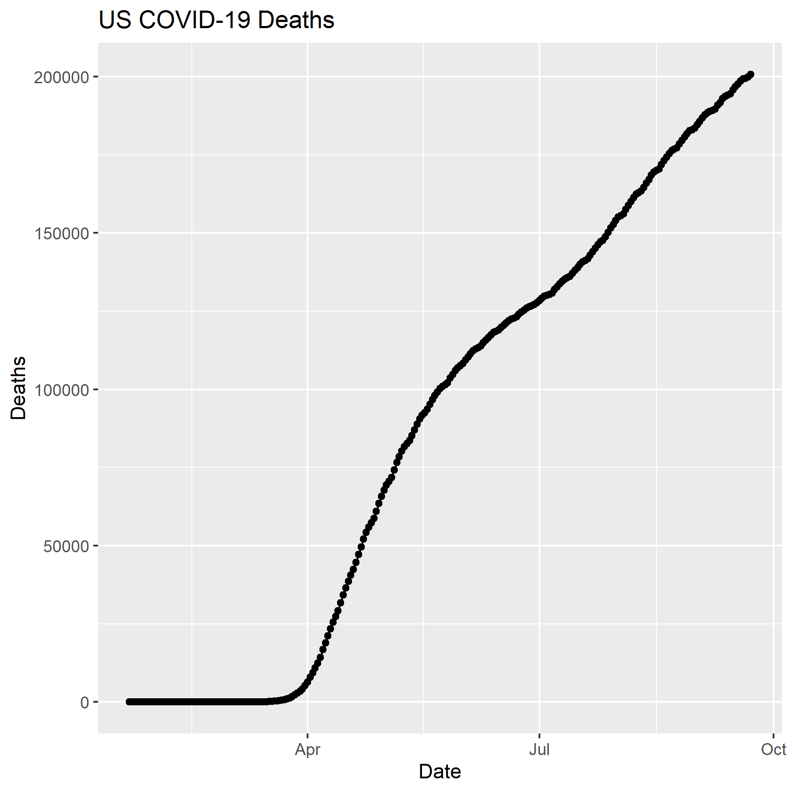

```{r setup, include=FALSE}
knitr::opts_chunk$set(echo = TRUE)
```

## Learning objectives
-Be able to add title, axis labels, legends, colors to ggplot graphs
-Resize graphs in RMarkdown
-Print graphics to a file (e.g. jpeg, pdf)
-Loading images into a RMarkdown file
-Making interactive and annimated graphs

# Data for the lab
Let’s start by loading libraries and the JHU time series data to work with below

```{r}
library(tidyverse)
library(lubridate)
```

```{r}
time_series_confirmed_long <- read_csv(url("https://raw.githubusercontent.com/CSSEGISandData/COVID-19/master/csse_covid_19_data/csse_covid_19_time_series/time_series_covid19_confirmed_global.csv")) %>%
  rename(Province_State = "Province/State", Country_Region = "Country/Region")  %>% 
               pivot_longer(-c(Province_State, Country_Region, Lat, Long),
                             names_to = "Date", values_to = "Confirmed") 
# Let's get the times series data for deaths
time_series_deaths_long <- read_csv(url("https://raw.githubusercontent.com/CSSEGISandData/COVID-19/master/csse_covid_19_data/csse_covid_19_time_series/time_series_covid19_deaths_global.csv")) %>%
  rename(Province_State = "Province/State", Country_Region = "Country/Region")  %>% 
  pivot_longer(-c(Province_State, Country_Region, Lat, Long),
               names_to = "Date", values_to = "Deaths")
# Create Keys 
time_series_confirmed_long <- time_series_confirmed_long %>% 
  unite(Key, Province_State, Country_Region, Date, sep = ".", remove = FALSE)
time_series_deaths_long <- time_series_deaths_long %>% 
  unite(Key, Province_State, Country_Region, Date, sep = ".") %>% 
  select(Key, Deaths)
# Join tables
time_series_long_joined <- full_join(time_series_confirmed_long,
    time_series_deaths_long, by = c("Key")) %>% 
    select(-Key)
# Reformat the data
time_series_long_joined$Date <- mdy(time_series_long_joined$Date)
# Create Report table with counts
time_series_long_joined_counts <- time_series_long_joined %>% 
  pivot_longer(-c(Province_State, Country_Region, Lat, Long, Date),
               names_to = "Report_Type", values_to = "Counts")
```

## Fine tuning ggplots
Another good R resources is the Cookbook for R by Winston Chang. It has some nice sections for tidying up graphs

-http://www.cookbook-r.com/Graphs/Axes_(ggplot2)/
-http://www.cookbook-r.com/Graphs/Titles_(ggplot2)/
-http://www.cookbook-r.com/Graphs/Legends_(ggplot2)/
-http://www.cookbook-r.com/Graphs/Colors_(ggplot2)/

Here are a couple of cheatsheets that can be useful

-https://rstudio.com/wp-content/uploads/2015/12/ggplot2-cheatsheet-2.0.pdf
-https://rstudio.com/wp-content/uploads/2016/03/rmarkdown-cheatsheet-2.0.pdf

## Controlling graph size in RMarkdown

In the opening line of the RMarkdown code chunk {r} you can control the output of the code, graphs, tables using knitr syntax. For example if {r, eval = FALSE} the code will not be run, but will be shown. If {r, code = FALSE} the code will not be shown, but will be run and the output will be shown (useful in reports where the reader is only interested in the results/graphs, but not the code). You can also suppress error messages and warnings so that the reader isn’t bothered by them (but you should take notice).

The dimensions of an individual graph in the RMarkdown document be adjusted by specifying the graph dimensions {r, fig.width = 6, fig.height = 6}

## Graphic Output

You may have realized that you can export plots in R Studio by clicking on Export in the Plots window that appears after you make a graph. You can save as a pdf, svg, tiff, png, bmp, jpeg and eps. You can also write the output directly to a file. This is particularly useful for controling the final dimensions in a reproducible way and for manuscripts.


```{r}
# Plot graph to a pdf outputfile
pdf("images/time_series_example_plot.pdf", width=6, height=3)
time_series_long_joined %>% 
  group_by(Country_Region,Date) %>% 
  summarise_at(c("Confirmed", "Deaths"), sum) %>% 
  filter (Country_Region == "US") %>% 
    ggplot(aes(x = Date,  y = Deaths)) + 
    geom_point() +
    geom_line() +
    ggtitle("US COVID-19 Deaths")
dev.off()

```

```{r}
# Plot graph to a png outputfile
ppi <- 300
png("images/time_series_example_plot.png", width=6*ppi, height=6*ppi, res=ppi)
time_series_long_joined %>% 
  group_by(Country_Region,Date) %>% 
  summarise_at(c("Confirmed", "Deaths"), sum) %>% 
  filter (Country_Region == "US") %>% 
    ggplot(aes(x = Date,  y = Deaths)) + 
    geom_point() +
    geom_line() +
    ggtitle("US COVID-19 Deaths")
dev.off()
```

## RMarkdown loading images

Sometimes it is useful in controling the image layout for a report to file with the graph and then subsequently load it into the .Rmd file. This works with png files, but not pdfs. You can also upload images made with other bioinformatic tools into your RMarkdown report.

 


We can also use an alternative method that utalizes html 


Another way to present a graph without the code is adding echo = FALSE within the r{} chunk - {r echo = FALSE}. This prevents code, but not the results from appearing in the knitr file.

## Interactive graphs

With plotly/ggplotly (https://plot.ly/ggplot2/) you can make interactive graphs in your lab report.

There are two common formats used in graphing that you may come across in examples. One very common format that we have not used to date is putting your graph into a variable and then plotting the variable. They both work perfectly fine.

```{r}
# Version 2
library(plotly)
ggplotly(
  time_series_long_joined %>% 
    group_by(Country_Region,Date) %>% 
    summarise_at(c("Confirmed", "Deaths"), sum) %>% 
    filter (Country_Region == "US") %>% 
    ggplot(aes(x = Date,  y = Deaths)) + 
      geom_point() +
      geom_line() +
      ggtitle("US COVID-19 Deaths")
 )
```
the second way to create a plotly graph is to simply make the graph as you would normally then apply the plotly to it as seen below


```{r}
library(plotly)
US_deaths <- time_series_long_joined %>% 
    group_by(Country_Region,Date) %>% 
    summarise_at(c("Confirmed", "Deaths"), sum) %>% 
    filter (Country_Region == "US")
 p <- ggplot(data = US_deaths, aes(x = Date,  y = Deaths)) + 
        geom_point() +
        geom_line() +
        ggtitle("US COVID-19 Deaths")
ggplotly(p)
```

## Animated Graphs with gganimate

Animated graphs when down right have a great visual impact. You can do this in R and have your animations embedded on your web page. Essentially gganimate creates a series of files that are encompassed in a gif file. In addition to having this gif as part of your report file, you can save the gif and use in a slide or other presentations. It just takes a few lines of code to covert and existing ggplot graph into an animation. See Tutorial for Getting Started with gganimate and gganimate: How to Create Plots with Beautiful Animation in R

This are some important gganimate functions:
- __transition_*()__ defines how the data should be spread out and how it relates to itself across time.
- __view_*()__ defines how the positional scales should change along the animation.
- __shadow_*()__ defines how data from other points in time should be presented in the given point in time.
- enter_()/exit_() defines how new data should appear and how old data should disappear during the course of the animation.
- ease_aes() defines how different aesthetics should be eased during transitions.

## Creating the animations

Below are the packages I installed. There may be others that you need, in particular to rendering gifs. Several people needed to install the packages gifski and av Some of the examples may take several minutes to create the animation.

```{r}
library(gganimate)
library(transformr)
theme_set(theme_bw())

```

An animation of the confirmed cases in select countries

```{r}
library(gifski)

data_time <- time_series_long_joined %>% 
    group_by(Country_Region,Date) %>% 
    summarise_at(c("Confirmed", "Deaths"), sum) %>% 
    filter (Country_Region %in% c("China","Korea, South","Japan","Italy","US")) 
p <- ggplot(data_time, aes(x = Date,  y = Confirmed, color = Country_Region)) + 
      geom_point() +
      geom_line() +
      ggtitle("Confirmed COVID-19 Cases") +
      geom_point(aes(group = seq_along(Date))) +
      transition_reveal(Date) 
# Some people needed to use this line instead
animate(p,renderer = gifski_renderer(), end_pause = 15)
#animate(p, end_pause = 15)

```


