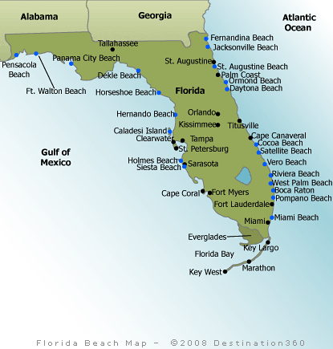

```{r setup, include=FALSE}
knitr::opts_chunk$set(echo = TRUE)
```

# Learning Objectives
- Making shape maps
- Interactive

# Creating Country, State and County maps
The ideas for this course tutorial came from multiple examples contributed by Prof. Chris Sutherland and these tutorials

1. https://cran.r-project.org/web/packages/maps/maps.pdf
2. https://ggplot2.tidyverse.org/reference/geom_map.html
3. https://www.r-spatial.org/r/2018/10/25/ggplot2-sf.html

For our labs two types of approaches will be used to add data to maps. The first that we worked with last week is based on using the longitude and latitude information to add a point at a specific position on a map. The second is two add the information to shapes in a map based on the name of the shape (e.g. states). Although ggmaps is a wonderful tool for mapping using Google Maps and other resources, it is beyond what is needed for now.

As in the previous labs the sources of data are from Github repo for Novel Coronavirus (COVID-19) Cases that supports the dashboard.

For this lab it is important to note that the time series data does not currently have entries for US States. The daily reports include US State and more recently US country/administrative units. Is possible to concatenate the daily reports to create a time series for US States, but cognizant of changes in the formats of the daily reports.

# Building maps
```{r, message=FALSE}
library(tidyverse)
library(maps)
library(mapdata)
library(lubridate)
library(viridis)
library(wesanderson)
library(plotly)
library(ggplot2)
library(gganimate)
library(transformr)
library(gifski)
library(av)
```
Here is a graph containing all the coordinate information. Note this is not summarized by country. Since there are now main points for US counties, there are many points in the US
```{r, message=FALSE}
daily_report <- read_csv(url("https://raw.githubusercontent.com/CSSEGISandData/COVID-19/master/csse_covid_19_data/csse_covid_19_daily_reports/04-02-2020.csv")) %>% 
  rename(Long = "Long_") 
    
ggplot(daily_report, aes(x = Long, y = Lat, size = Confirmed/1000)) +
    borders("world", colour = NA, fill = "grey90") +
    theme_bw() +
    geom_point(shape = 21, color='purple', fill='purple', alpha = 0.5) +
    labs(title = 'World COVID-19 Confirmed cases',x = '', y = '',
        size="Cases (x1000))") +
    theme(legend.position = "right") +
    coord_fixed(ratio=1.5)
```
Zoom in on US 48 states. To do this Alaska, Hawaii and US Territories are filtered. Some US State entries have a Lat and Long of zero, so these are filtered as well.
```{r}
daily_report <-   read_csv(url("https://raw.githubusercontent.com/CSSEGISandData/COVID-19/master/csse_covid_19_data/csse_covid_19_daily_reports/04-05-2020.csv")) %>% 
  rename(Long = "Long_") %>% 
  filter(Country_Region == "US") %>% 
  filter (!Province_State %in% c("Alaska","Hawaii", "American Samoa",
                  "Puerto Rico","Northern Mariana Islands", 
                  "Virgin Islands", "Recovered", "Guam", "Grand Princess",
                  "District of Columbia", "Diamond Princess")) %>% 
  filter(Lat > 0)
ggplot(daily_report, aes(x = Long, y = Lat, size = Confirmed/1000)) +
    borders("state", colour = "black", fill = "grey90") +
    theme_bw() +
    geom_point(shape = 21, color='purple', fill='purple', alpha = 0.5) +
    labs(title = 'COVID-19 Confirmed Cases in the US', x = '', y = '',
        size="Cases (x1000))") +
    theme(legend.position = "right") +
    coord_fixed(ratio=1.5)
```
Here is a prettier version based on an example by Anisa Dhana

```{r, message=FALSE}
mybreaks <- c(1, 100, 1000, 10000, 10000)
ggplot(daily_report, aes(x = Long, y = Lat, size = Confirmed)) +
    borders("state", colour = "white", fill = "grey90") +
    geom_point(aes(x=Long, y=Lat, size=Confirmed, color=Confirmed),stroke=F, alpha=0.7) +
    scale_size_continuous(name="Cases", trans="log", range=c(1,7), 
                        breaks=mybreaks, labels = c("1-99",
                        "100-999", "1,000-9,999", "10,000-99,999", "50,000+")) +
    scale_color_viridis_c(option="viridis",name="Cases",
                        trans="log", breaks=mybreaks, labels = c("1-99",
                        "100-999", "1,000-9,999", "10,000-99,999", "50,000+"))  +
# Cleaning up the graph
  
  theme_void() + 
    guides( colour = guide_legend()) +
    labs(title = "Anisa Dhana's lagout for COVID-19 Confirmed Cases in the US'") +
    theme(
      legend.position = "bottom",
      text = element_text(color = "#22211d"),
      plot.background = element_rect(fill = "#ffffff", color = NA), 
      panel.background = element_rect(fill = "#ffffff", color = NA), 
      legend.background = element_rect(fill = "#ffffff", color = NA)
    ) +
    coord_fixed(ratio=1.5)
```
# Mapping data to shapes
```{r}
daily_report <- read_csv(url("https://raw.githubusercontent.com/CSSEGISandData/COVID-19/master/csse_covid_19_data/csse_covid_19_daily_reports/04-02-2020.csv")) %>% 
  rename(Long = "Long_") %>% 
  filter(Country_Region == "US") %>% 
  group_by(Province_State) %>% 
  summarize(Confirmed = sum(Confirmed)) %>% 
  mutate(Province_State = tolower(Province_State))
# load the US map data
us <- map_data("state")
# We need to join the us map data with our daily report to make one data frame/tibble
state_join <- left_join(us, daily_report, by = c("region" = "Province_State"))

```
Using R color palattes
This is a bit of a digression back to Labs 3 and 4, but there are many R color palattes to choose from or you can create your own. In the above a simple gradient is used. The example from Anisa Dhana uses the viridis palatte which is designed to be perceived by viewers with common forms of colour blindness. Here is an example using a different color package - Wes Anderson. …and more Top R Color Palettes to Know for Great Data Visualization
```{r}
# plot state map
ggplot(data = us, mapping = aes(x = long, y = lat, group = group)) + 
  coord_fixed(1.3) + 
# Add data layer
  geom_polygon(data = state_join, aes(fill = Confirmed), color = "black") +
  scale_fill_gradientn(colours = 
                         wes_palette("Zissou1", 100, type = "continuous"),
                         trans = "log10") +
  labs(title = "COVID-19 Confirmed Cases in the US'")
```

A look now by the counties using the RColorBrewer
```{r, message=FALSE}
library(RColorBrewer)
# To display only colorblind-friendly brewer palettes, specify the option colorblindFriendly = TRUE as follow:
# display.brewer.all(colorblindFriendly = TRUE)
# Get and format the covid report data
report_03_27_2020 <-   read_csv(url("https://raw.githubusercontent.com/CSSEGISandData/COVID-19/master/csse_covid_19_data/csse_covid_19_daily_reports/04-02-2020.csv")) %>% 
  rename(Long = "Long_") %>% 
  unite(Key, Admin2, Province_State, sep = ".") %>% 
  group_by(Key) %>% 
  summarize(Confirmed = sum(Confirmed)) %>% 
  mutate(Key = tolower(Key))
# dim(report_03_27_2020)
# get and format the map data
us <- map_data("state")
counties <- map_data("county") %>% 
  unite(Key, subregion, region, sep = ".", remove = FALSE)
# Join the 2 tibbles
state_join <- left_join(counties, report_03_27_2020, by = c("Key"))
# sum(is.na(state_join$Confirmed))
ggplot(data = us, mapping = aes(x = long, y = lat, group = group)) + 
  coord_fixed(1.3) + 
  # Add data layer
  borders("state", colour = "black") +
  geom_polygon(data = state_join, aes(fill = Confirmed)) +
  scale_fill_gradientn(colors = brewer.pal(n = 5, name = "PuRd"),
                       breaks = c(1, 10, 100, 1000, 10000, 100000),
                       trans = "log10", na.value = "White") +
  ggtitle("Number of Confirmed Cases by US County") +
  theme_bw() 
```
If we look at just Massachusetts

```{r}
daily_report <-   read_csv(url("https://raw.githubusercontent.com/CSSEGISandData/COVID-19/master/csse_covid_19_data/csse_covid_19_daily_reports/04-02-2020.csv")) %>% 
  rename(Long = "Long_") %>% 
  filter(Province_State == "Massachusetts") %>% 
  group_by(Admin2) %>% 
  summarize(Confirmed = sum(Confirmed)) %>% 
  mutate(Admin2 = tolower(Admin2))
us <- map_data("state")
ma_us <- subset(us, region == "massachusetts")
counties <- map_data("county")
ma_county <- subset(counties, region == "massachusetts")
state_join <- left_join(ma_county, daily_report, by = c("subregion" = "Admin2")) 
# plot state map
ggplot(data = ma_county, mapping = aes(x = long, y = lat, group = group)) + 
  coord_fixed(1.3) + 
# Add data layer
  geom_polygon(data = state_join, aes(fill = Confirmed), color = "white") +
    scale_fill_gradientn(colors = brewer.pal(n = 5, name = "BuGn"),
                         trans = "log10") +
  labs(title = "COVID-19 Confirmed Cases in Massachusetts'")
```
Note the cases on Nantucket and Dukes counties were reported as one value and not included on the graph. There is also an asssigned category that includes 303 Confirmed cases as of 3/31/2020.

```{r}
daily_report
```

# Interactive graphs
In Lab 5 plotly was introduced. It is a great simple way to make interactive graphs with the maps
```{r}
library(plotly)
ggplotly(
  ggplot(data = ma_county, mapping = aes(x = long, y = lat, group = group)) + 
  coord_fixed(1.3) + 
# Add data layer
  geom_polygon(data = state_join, aes(fill = Confirmed), color = "black") +
    scale_fill_gradientn(colours = 
                         wes_palette("Zissou1", 100, type = "continuous")) +
  ggtitle("COVID-19 Cases in MA") +
# Cleaning up the graph
  labs(x=NULL, y=NULL) +
  theme(panel.border = element_blank()) +
  theme(panel.background = element_blank()) +
  theme(axis.ticks = element_blank()) +
  theme(axis.text = element_blank())
)

```

Here is an example with the world map

```{r}
# Read in the daily report
daily_report <- read_csv(url("https://raw.githubusercontent.com/CSSEGISandData/COVID-19/master/csse_covid_19_data/csse_covid_19_daily_reports/09-26-2020.csv")) %>% 
  rename(Long = "Long_") %>% 
  group_by(Country_Region) %>% 
  summarize(Confirmed = sum(Confirmed), Deaths = sum(Deaths))

# Read in the world map data
world <- as_tibble(map_data("world"))

# Check to see if there are differences in the naming of countries
setdiff(world$region, daily_report$Country_Region) 
```

```{r}
# Many of these countries are considered states or territories in the JHU covid reports,
# but let's fix a few of them

world <- as_tibble(map_data("world")) %>% 
 mutate(region = str_replace_all(region, c("USA" = "US", "Czech Republic" = "Czechia",  
        "Ivory Coast" = "Cote d'Ivoire", "Democratic Republic of the Congo" = "Congo (Kinshasa)", 
        "Republic of Congo" = "Congo (Brazzaville)")))

# Join the covid report with the map data
country_join <- left_join(world, daily_report, by = c("region" = "Country_Region"))

# Create the graph
ggplotly(
ggplot(data = world, mapping = aes(x = long, y = lat, text = region, group = group)) + 
  coord_fixed(1.3) + 
# Add data layer
  geom_polygon(data = country_join, aes(fill = Deaths), color = "black") +
  scale_fill_gradientn(colours = 
                         wes_palette("Zissou1", 100, type = "continuous")) +
  labs(title = "COVID-19 Deaths'")
)
```


#Exercises 

# Exercise 1

```{r, message=FALSE}
daily_report_26 <- read_csv(url("https://raw.githubusercontent.com/CSSEGISandData/COVID-19/master/csse_covid_19_data/csse_covid_19_daily_reports/09-26-2020.csv")) %>% 
  rename(Long = "Long_") 

ggplot(daily_report_26, aes(x = Long, y = Lat, size = Confirmed/1000)) +
    borders("world", colour = NA, fill = "grey90") +
    theme_bw() +
    geom_point(shape = 21, color='purple', fill='purple', alpha = 0.5) +
    labs(title = 'World COVID-19 Confirmed cases as of 9/26/2020',x = '', y = '',
        size="Cases (x1000))") +
    theme(legend.position = "right") +
    coord_fixed(ratio=1.5)
```

# Exercise 2

```{r}
daily_report_26_US <- read_csv(url("https://raw.githubusercontent.com/CSSEGISandData/COVID-19/master/csse_covid_19_data/csse_covid_19_daily_reports/09-26-2020.csv")) %>% 
  rename(Long = "Long_") %>% 
  filter(Country_Region == "US") %>% 
  filter (!Province_State %in% c("Alaska","Hawaii", "American Samoa",
                  "Puerto Rico","Northern Mariana Islands", 
                  "Virgin Islands", "Recovered", "Guam", "Grand Princess",
                  "District of Columbia", "Diamond Princess"))

mybreaks <- c(1, 100, 1000, 10000, 10000)
ggplot(daily_report_26_US, aes(x = Long, y = Lat, size = Confirmed)) +
    borders("state", colour = "white", fill = "grey90") +
    geom_point(aes(x=Long, y=Lat, size=Confirmed, color=Confirmed),stroke=F, alpha=0.7) +
    scale_size_continuous(name="Cases", trans="log", range=c(1,7), 
                        breaks=mybreaks, labels = c("1-99",
                        "100-999", "1,000-9,999", "10,000-99,999", "50,000+")) +
    scale_color_viridis_c(option="viridis",name="Cases",
                        trans="log", breaks=mybreaks, labels = c("1-99",
                        "100-999", "1,000-9,999", "10,000-99,999", "50,000+"))  +
# Cleaning up the graph
  
  theme_void() + 
    guides( colour = guide_legend()) +
    labs(title = "Anisa Dhana's lagout for COVID-19 Confirmed Cases in the US as of 9/26/2020'") +
    theme(
      legend.position = "bottom",
      text = element_text(color = "#22211d"),
      plot.background = element_rect(fill = "#ffffff", color = NA), 
      panel.background = element_rect(fill = "#ffffff", color = NA), 
      legend.background = element_rect(fill = "#ffffff", color = NA)
    ) +
    coord_fixed(ratio=1.5)

```

# Exercise 3

```{r}
library(RColorBrewer)
# To display only colorblind-friendly brewer palettes, specify the option colorblindFriendly = TRUE as follow:
# display.brewer.all(colorblindFriendly = TRUE)
# Get and format the covid report data
report_03_27_2020 <-   read_csv(url("https://raw.githubusercontent.com/CSSEGISandData/COVID-19/master/csse_covid_19_data/csse_covid_19_daily_reports/09-26-2020.csv")) %>% 
  rename(Long = "Long_") %>% 
  unite(Key, Admin2, Province_State, sep = ".") %>% 
  group_by(Key) %>% 
  summarize(Confirmed = sum(Confirmed)) %>% 
  mutate(Key = tolower(Key))
# dim(report_03_27_2020)
# get and format the map data
us <- map_data("state")
counties <- map_data("county") %>% 
  unite(Key, subregion, region, sep = ".", remove = FALSE)
# Join the 2 tibbles
state_join <- left_join(counties, report_03_27_2020, by = c("Key"))
# sum(is.na(state_join$Confirmed))
ggplot(data = us, mapping = aes(x = long, y = lat, group = group)) + 
  coord_fixed(1.3) + 
  # Add data layer
  borders("state", colour = "black") +
  geom_polygon(data = state_join, aes(fill = Confirmed)) +
  scale_fill_gradientn(colors = brewer.pal(n = 5, name = "YlOrRd"),
                       breaks = c(1, 10, 100, 1000, 10000, 100000),
                       trans = "log10", na.value = "White") +
  ggtitle("Number of Confirmed Cases by US County") +
  theme_bw() 
```

# Exercise 4 

```{r}
library(plotly)
library(viridis)

daily_report_NC <-   read_csv(url("https://raw.githubusercontent.com/CSSEGISandData/COVID-19/master/csse_covid_19_data/csse_covid_19_daily_reports/09-26-2020.csv")) %>% 
  rename(Long = "Long_") %>% 
  filter(Province_State == "North Carolina") %>% 
  group_by(Admin2) %>% 
  summarize(Confirmed = sum(Confirmed)) %>% 
  mutate(Admin2 = tolower(Admin2))


us <- map_data("state")
nc_us <- subset(us, region == "north carolina")
counties <- map_data("county")
nc_county <- subset(counties, region == "north carolina")
state_join_nc <- left_join(nc_county, daily_report_NC, by = c("subregion" = "Admin2")) 


ggplotly(
  ggplot(data = nc_county, mapping = aes(x = long, y = lat, group = group)) + 
  coord_fixed(1.3) + 
# Add data layer
  geom_polygon(data = state_join_nc, aes(fill = Confirmed), color = "black") +
    scale_fill_viridis(discrete = FALSE) +
  ggtitle("COVID-19 Cases in NC (9/28/2020)") +
# Cleaning up the graph
  labs(x=NULL, y=NULL) +
  theme(panel.border = element_blank()) +
  theme(panel.background = element_blank()) +
  theme(axis.ticks = element_blank()) +
  theme(axis.text = element_blank())
)

```


# Exercise 5 / Lab Report

According to the John's Hopkins Coronavirus Resource center, as of September 28th, there are over 34 million cases of the novel corona virus worldwide. With the pandemic being delcared on March 11th, everyone around the globe has been affected in some way shape or form. Although most places on the globe have been affected, different countries have handled the virus differently.The methods for handling the virus as well as political climate have created a heavy variance in the impact that the virus has taken on certain countries which can be represented by infections/confirmed cases. To get a better idea of how countries are doing around the globe, we can A heat map of the world based on Corona virus cases which is shown in **FIG1**.

```{r, message = FALSE, error=FALSE, echo=FALSE}
ggplotly(
ggplot(data = world, mapping = aes(x = long, y = lat, text = region, group = group)) + 
  coord_fixed(1.3) + 
# Add data layer
  geom_polygon(data = country_join, aes(fill = Confirmed), color = "black") +
  scale_fill_viridis() +
  labs(title = "Confirmed COVID-19 Cases Around the Globe")
)
```

**Figure 1** Distribution of Covid-19 cases around the world by country. Confrimed specifically to the total number of confirmed cases reported by a given country as of September 28th, 2020.

Taking a look at **FIG1** it become glaringly obvious that the united states is the sole leader in terms of confirmed cases of Covid 19 by quite a landslide. To look at the US in relation with some of the other countries around the world that have struggled in handling the virus, we can look at **FIG2**. Here we can see that since the start of the pandemic, there have been over 7 Million cases in the United States alone with countries such as India, Brazil, and Russia also seeing case numbers over a million

```{r, message = FALSE, error=FALSE, echo=FALSE}
daily_report_28 <- read_csv(url("https://raw.githubusercontent.com/CSSEGISandData/COVID-19/master/csse_covid_19_data/csse_covid_19_daily_reports/09-28-2020.csv")) %>% 
  rename(Long = "Long_")

groupedReport = daily_report_28 %>% 
  group_by(Country_Region) %>% 
  summarize(Total_Cases = sum(Confirmed), Deaths = sum(Deaths), Recovered = sum(Recovered), Active = sum(Active))

top10 = groupedReport %>% 
  select(Country_Region, Total_Cases) %>% 
  arrange(desc(Total_Cases)) %>% 
  slice(0:10)

top10

```

**Figure 2** Top 10 Countries by Covid-19 Cases

Over the past few months, the United States has been under large amounts of scrutiny for the way in which it has handled the virus. While there are many aspects that contribute to the reasons why the US has been struggling we can see in **FIG3**, **FIG4**, & **FIG5** the progression of the virus in the Uited Sates as a whole as well each states from the start of the pandemic until now.

```{r, message = FALSE, error=FALSE, echo=FALSE}
daily_reportX <-read_csv(url("https://raw.githubusercontent.com/CSSEGISandData/COVID-19/master/csse_covid_19_data/csse_covid_19_daily_reports/04-11-2020.csv")) %>% 
  dplyr::rename(Long = "Long_") %>%
  dplyr::filter(Country_Region == "US") %>%
  dplyr::group_by(Province_State) %>%
  dplyr::summarize(Confirmed = sum(Confirmed)) %>%
  dplyr::mutate(Province_State = tolower(Province_State))
  
state_join2 <- left_join(us, daily_reportX, by = c("region" = "Province_State"))

ggplotly(
  ggplot(data = us, mapping = aes(x = long, y = lat, group = group)) + 
  coord_fixed(1.3) + 
# Add data layer
  geom_polygon(data = state_join2, aes(fill = Confirmed), color = "black") +
  scale_fill_gradient(low = "blue", high = "green", na.value = NA) +
  ggtitle("COVID-19 Cases Across the US (4-11-2020)") +
# Cleaning up the graph
  labs(x=NULL, y=NULL) +
  theme(panel.border = element_blank()) +
  theme(panel.background = element_blank()) +
  theme(axis.ticks = element_blank()) +
  theme(axis.text = element_blank()) 
)
```
**Figure 3** Total confirmed Covid-19 Cases in US at the start of the pandemic


```{r, message = FALSE, error=FALSE, echo=FALSE}

daily_report <- read_csv(url("https://raw.githubusercontent.com/CSSEGISandData/COVID-19/master/csse_covid_19_data/csse_covid_19_daily_reports/09-28-2020.csv")) %>% 
  rename(Long = "Long_") %>% 
  filter(Country_Region == "US") %>% 
  group_by(Province_State) %>% 
  summarize(Confirmed = sum(Confirmed)) %>% 
  mutate(Province_State = tolower(Province_State))
# load the US map data
us <- map_data("state")
# We need to join the us map data with our daily report to make one data frame/tibble
state_join <- left_join(us, daily_report, by = c("region" = "Province_State"))

# plot state map
ggplotly(
ggplot(data = us, mapping = aes(x = long, y = lat, group = group)) + 
  coord_fixed(1.3) + 
# Add data layer
  geom_polygon(data = state_join, aes(fill = Confirmed), color = "black") +
  scale_fill_gradient(low = "blue", high = "green", na.value = NA) +
  labs(title = "COVID-19 Cases Across the US' (9-28-2020)")
)


```
**Figure 4** Total confirmed Covid-19 cases across the United Stats as of September 28th, 2020

```{r, message = FALSE, error=FALSE, echo=FALSE}
time_series_confirmed_long <- read_csv(url("https://raw.githubusercontent.com/CSSEGISandData/COVID-19/master/csse_covid_19_data/csse_covid_19_time_series/time_series_covid19_confirmed_global.csv")) %>%
  rename(Province_State = "Province/State", Country_Region = "Country/Region")  %>% 
               pivot_longer(-c(Province_State, Country_Region, Lat, Long),
                            names_to = "Date", values_to = "Confirmed") 

# Let's get the times series data for deaths

time_series_deaths_long <- read_csv(url("https://raw.githubusercontent.com/CSSEGISandData/COVID-19/master/csse_covid_19_data/csse_covid_19_time_series/time_series_covid19_deaths_global.csv")) %>%
  rename(Province_State = "Province/State", Country_Region = "Country/Region")  %>% 
  pivot_longer(-c(Province_State, Country_Region, Lat, Long),
               names_to = "Date", values_to = "Deaths")

time_series_recovered_long <- read_csv(url("https://raw.githubusercontent.com/CSSEGISandData/COVID-19/master/csse_covid_19_data/csse_covid_19_time_series/time_series_covid19_recovered_global.csv")) %>%
  rename(Province_State = "Province/State", Country_Region = "Country/Region") %>% 
  pivot_longer(-c(Province_State, Country_Region, Lat, Long),
               names_to = "Date", values_to = "Recovered")

# Create Keys 

time_series_confirmed_long <- time_series_confirmed_long %>% 
  unite(Key, Province_State, Country_Region, Date, sep = ".", remove = FALSE)

time_series_deaths_long <- time_series_deaths_long %>% 
  unite(Key, Province_State, Country_Region, Date, sep = ".") %>% 
  select(Key, Deaths)

time_series_recovered_long <- time_series_recovered_long %>% 
  unite(Key, Province_State, Country_Region, Date, sep = ".") %>% 
  select(Key, Recovered)

# Join tables
time_series_long_joined <- full_join(time_series_confirmed_long,
              time_series_deaths_long, by = c("Key"))

time_series_long_joined <- full_join(time_series_long_joined,
              time_series_recovered_long, by = c("Key")) %>% 
    select(-Key)

# Reformat the data
time_series_long_joined$Date <- mdy(time_series_long_joined$Date)

# Create Report table with counts
time_series_long_joined_counts <- time_series_long_joined %>% 
  pivot_longer(-c(Province_State, Country_Region, Lat, Long, Date),
               names_to = "Report_Type", values_to = "Counts")


date_time2 <- time_series_long_joined_counts %>% 
  group_by(Country_Region, Report_Type, Date) %>% 
  summarise(Counts = sum(Counts)) %>% 
  filter (Country_Region == "US")

```

```{r, message = FALSE, error=FALSE, echo=FALSE}
p2 <- ggplot(date_time2, aes(x = Date,  y = Counts, color = Report_Type)) + 
      geom_point() +
      geom_line() +
      ggtitle("Confirmed COVID-19 Cases in the US") +
      geom_point(aes(group = seq_along(Date))) +
      transition_reveal(Date) + ylab("Cases")
    
animate(p2,renderer = gifski_renderer(), end_pause = 15)

```

**Figure 5** Time series graph of total cases, deaths and recoiveries of Covid-19 across the United States.


As we can see in **FIG 5** in terms of raw cases, the united states appears to show an almost exponential line that does not appear to be decreasing. I believe that part of the reasoning for this might be explained by spikes which have occured periodically throughout the country since March. If we look at the individual states in **FIG 3** & **FIG 4**, we can start to get a better idea of this. Here we can see that although states such as New York, Massachusetts, and New Jersey were hit hard by the virus very early on, southern states like California, Texas, and Florida eclipsed these states and became hot beds for the virus and have remained as such. If we take a look at **FIG 5** we might be able to find some reasoning for this. To begin, it is important to note that confirmed cases in the US has never truly ceasee to stop increasing. In fact taking a brief look at the general slope of the line, the amount of confirmed cases has been rapdily increasing in recent months with summer (June-August) Appearing be a catalyst for this. 

One state that has been source of both virus cases as well as controversy has been Florida. We know that Florida had a working COVID-19 tracking dashboard that was created by Rebekah Jones, but she was fired after failing to misreport numbers in order to support reopening plans. This is not the only state to do something of this nature.Just last month they mayaor of Nashville Tenesse came under scrutiny for failing to properly report outbreak bubbles in order to keep music bars open for business.

If we take a look at **Figure 6** and **Figure 7** we can get a better understanding of the distribution of cases across the state of florida, as well as a timeline of their cases, deaths, and recoveries. 

```{r, message = FALSE, error=FALSE, echo=FALSE}

daily_report_FL <-   read_csv(url("https://raw.githubusercontent.com/CSSEGISandData/COVID-19/master/csse_covid_19_data/csse_covid_19_daily_reports/09-28-2020.csv")) %>% 
  rename(Long = "Long_") %>% 
  filter(Province_State == "Florida") %>% 
  group_by(Admin2) %>% 
  summarize(Confirmed = sum(Confirmed)) %>% 
  mutate(Admin2 = tolower(Admin2))


us <- map_data("state")
fl_us <- subset(us, region == "florida")
counties <- map_data("county")
fl_county <- subset(counties, region == "florida")
state_join_fl <- left_join(fl_county, daily_report_FL, by = c("subregion" = "Admin2")) 


ggplotly(
  ggplot(data = fl_county, mapping = aes(x = long, y = lat, group = group)) + 
  coord_fixed(1.3) + 
# Add data layer
  geom_polygon(data = state_join_fl, aes(fill = Confirmed), color = "black") +
    scale_fill_viridis(option="plasma") +
  ggtitle("COVID-19 Cases in Florida (9/28/2020)") +
# Cleaning up the graph
  labs(x=NULL, y=NULL) +
  theme(panel.border = element_blank()) +
  theme(panel.background = element_blank()) +
  theme(axis.ticks = element_blank()) +
  theme(axis.text = element_blank()))


```

**Figure 6** Interactive map of confirmed covid-19 across the state of Florida

```{r, message = FALSE, error=FALSE, echo=FALSE}
time_series_confirmed_US = read_csv("data/time_series_covid19_confirmed_US.csv")

time_series_confirmed_US = time_series_confirmed_US %>% 
               pivot_longer(-c(Province_State, Country_Region, UID, iso2, iso3, code3, FIPS, Admin2, Province_State, Country_Region, Lat, Long_, Combined_Key),
                            names_to = "Date", values_to = "Confirmed") 
time_series_confirmed_US$Date = mdy(time_series_confirmed_US$Date)

time_series_confirmed_US %>% 
  group_by(Province_State, Date) %>% 
  summarise_at(c("Confirmed"), sum) %>% 
  filter(Province_State == "Florida") %>%
  ggplot(aes(x = Date,  y = Confirmed)) + 
    geom_point() +
    geom_line() +
    ggtitle("Time Lapse of Confrimed COVID-19 Cases in Florida")


```

**Figure 7** Time series graph of confirmed Covid-19 cases in Florida


As we can see, cases in Florida did not start to rise until about April where it then proceeded massivley spike around July. One reasoning for this happening is that Florida never truly closed. Many of their beaches and attractions remained open throughout spring vacation for students as well as summer vacationers. If we look at the interactive map of cases in Flroida by county **FIG 6** and comapre it with the map of popular beaches below in **FIG 8** we can start to see that many of these zones where areas that were hit especially hard with the largest amount of cases occuring in the Miami-Dade County. 



**Figure 9** Map of popular beaches across Florida


While each country has handled the virus in its own way, it is clear that until we have some form of breakthrough, we will be stuck with the Covid-19 virus for quite some time. Many people believed that this virus would be gone by fall, however based upon the animated version of Prof. Chris Sutherland's world graph **FIG 9** we can see that this virus has certainly shown no signs of stopping and in many areas has even begun to see peaks again. It will be interesting to see how the world will handle this situation in the months to come and what the data may look like months-years from now when we have finally found a way to deal with the virus.


```{r, message = FALSE, error=FALSE, warning=FALSE, echo=FALSE}
covid <- read_csv(url("https://raw.githubusercontent.com/CSSEGISandData/COVID-19/master/csse_covid_19_data/csse_covid_19_time_series/time_series_covid19_confirmed_global.csv")) %>%
           rename(Province_State= "Province/State", Country_Region = "Country/Region") %>%
           pivot_longer(-c(Province_State, Country_Region, Lat, Long),
                  names_to = "Date", values_to = "Confirmed") %>%
           mutate(Date = mdy(Date) - days(1),
                  Place = paste(Lat,Long,sep="_")) %>%
# Summarizes state and province information
             group_by(Place,Date) %>%
           summarise(cumulative_cases = ifelse(sum(Confirmed)>0,
                     sum(Confirmed),NA_real_),
                     Lat = mean(Lat),
                     Long = mean(Long)) %>%
           mutate(Pandemic_day = as.numeric(Date - min(Date)))

world <- ggplot(covid,aes(x = Long, y = Lat, size = cumulative_cases/1000)) +
                 borders("world", colour = "gray50", fill = "grey90") +
                 theme_bw() +
                 geom_point(color='Red', alpha = .5) +
                 labs(title = 'Pandemic Day: {frame}',x = '', y = '',
                      size="Cases (x1000))") +
                 theme(legend.position = "right") +
                 coord_fixed(ratio=1.3)+
                 transition_time(Date) +
                 enter_fade()

animate(world, renderer = gifski_renderer())
```

**Figure 10** Animated adaptation of Professor Chris Sutherlands Covid-19 Case Graph

