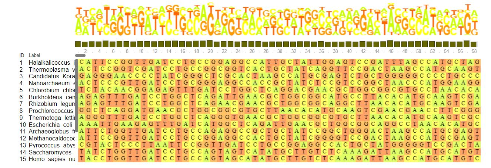
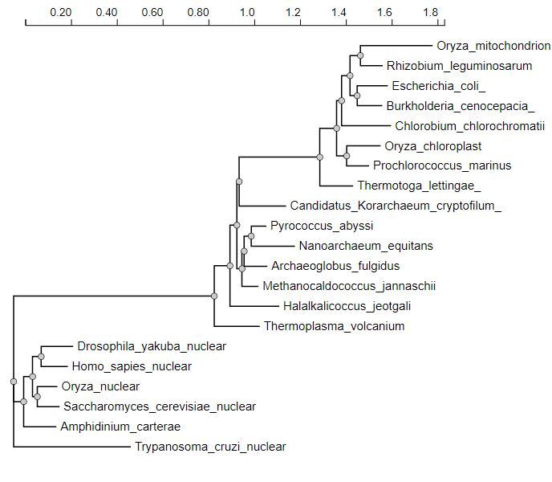

```{r setup, include=FALSE}
knitr::opts_chunk$set(echo = TRUE)
```

# Exercises

## 1: Phylogenetic Analysis using NGPhylogeny.fr

Phylogenetic analysis is quite complex and involves a number of different steps to complete. First you need to assemble a group a sequences from various organisms across different walks of life. In the case of this lab, we took the sequences/data from the following species:

* Thermoplasma volcanium
* Halalkalicoccus jeotgali
* Candidatus Korarchaeum cryptofilum
* Nanoarchaeum equitans
* Chlorobium chlorochromatii
* Burkholderia cenocepacia
* Rhizobium leguminosarum
* Escherichia coli
* Archaeoglobus fulgidus
* Methanocaldococcus jannaschii
* Pyrococcus abyssi
* Oryza sativa nuclear
* Oryza sativa mitochondrion
* Oryza sativa chloroplast
* Saccharomyces cerevisiae nuclear
* Homo sapies nuclear
* Drosophila yakuba nuclear
* Amphidinium carterae nuclear
* Thermotoga lettingae
* Prochlorococcus marinus
* Trypanosoma cruzi

After Putting the sequence data into the workflow we can see the pre-aligned sequences in the image below...



From here, we have to align the sequences so that distances can be calcualted between the different sequences. This helps us to determine the relatedness between the different sequences which in turn helps us to determine how close the sequences are to each other. One such tool used to do this is MAFFT, which is generally used when working with large data sets. A portion output of the MAFFT alignment from the workflow is included below an example...


Finally, from here the relationships between the sequences can be analyzed and then visualized in the form of a phylogenetic tree. The numbers used in the tree scale represent statistical support for the relationship. The more robust the relationship the closer the value will be to 1. The scale at the bottom represents sequence distance (in this case 0.1 would be representative of 10%). I have included the output tree from the wrokflow below...



## ggtree tutorial


### The ggtree Package

```{r, message=FALSE}
library(tidyverse)
library(ggtree)
# added treeio and ggimage library
library(treeio)
library(ggimage)
# need to install libmagick 
#sudo apt-get install libmagick++-dev
```

### Tree Import

Before we dive into the tutorial there are a few important things to note. 

ggtree  supports several file formats:

* Newick
* Nexus
* Phylip
* Jplace
* New Hampshire eXtended format (NHX)

as well as software outputs from:

* BEAST
* EPA
* HYPHY
* PAML
* PHYLDOG
* pplacer
* r8s
* RAxML
* RevBayes

The ggtree package also implements several parser functions, including:

* read.tree for reading Newick files.
* read.phylip for reading Phylip files.
* read.jplace for reading Jplace files.
* read.nhx for reading NHX files.
* read.beast for parsing output of BEAST
* read.codeml for parsing output of CODEML (rst and mlc files)
* read.codeml_mlc for parsing mlc file (output of CODEML)
* read.hyphy for parsing output of HYPHY
* read.jplace for parsing jplace file including output from EPA and pplacer
* read.nhx for parsing NHX file including output from PHYLODOG and RevBayes
* read.paml_rst for parsing rst file (output of BASEML and CODEML)
* read.r8s for parsing output of r8s
* read.raxml for parsing output of RAxML

### Basic trees

let us start by importing our tree data 

```{r}
library(tidyverse)
library(ggtree)
tree <- read.tree("data/tree_newick.nwk")
tree
```

Just like with ggplot2 we created a basic canvas with ggplot(...) and added layers with +geom_???(), we can do the same here. The ggtree package gives us a geom_tree() function. Because ggtree is built on top of ggplot2, you get ggplot2’s default gray theme with white lines. You can override this with a theme from the ggtree package.

Because you’ll almost always want to add a tree geom and remove the default background and axes, the ggtree() function is essentially a shortcut for ggplot(...) + geom_tree() + theme_tree().

```{r}
# build a ggplot with a geom_tree
ggplot(tree) + geom_tree() + theme_tree()
# This is convenient shorthand
ggtree(tree)


```

The default is to plot a phylogram, where the x-axis shows the genetic change / evolutionary distance. If you want to disable scaling and produce a cladogram instead, set the branch.length="none" option inside the ggtree() call. See ?ggtree for more.

```{r}
ggtree(tree, branch.length="none")
```

The ... option in the help for ?ggtree represents additional options that are further passed to ggplot(). You can use this to change aesthetics of the plot. Let’s draw a cladogram (no branch scaling) using thick blue dotted lines (note that I’m not mapping these aesthetics to features of the data with aes() – we’ll get to that later).

```{r}
ggtree(tree, branch.length="none", color="blue", size=2, linetype=3)
```

### Sub Exercise 1 

1.) 
```{r}
ggtree(tree, branch.length="none", layout = 'slanted')
```

2.)

```{r}
ggtree(tree, layout = 'circular')
```

3.)

```{r}
ggtree(tree, branch.length="none",  layout = 'circular', color="red", linetype = 1, lwd = 1.25, )
```

### Other tree geoms

Let’s add additional layers. As we did in the ggplot2 lesson, we can create a plot object, e.g., p, to store the basic layout of a ggplot, and add more layers to it as we desire. Let’s add node and tip points. Let’s finally label the tips.

```{r}

# create the basic plot
p <- ggtree(tree)
# add node points
p + geom_nodepoint()
# add tip points
p + geom_tippoint()
# Label the tips
p + geom_tiplab()

```

### Sub exericse 2

```{r}
p + geom_tiplab(color = 'purple') + geom_tippoint(color='purple', size=2, shape = 'diamond') + geom_nodepoint(color = 'gold', alpha = 0.5, size = 3) + ggtitle("Exercise 2 Graph")
```

### Tree annotation

The geom_tiplab() function adds some very rudimentary annotation. Let’s take annotation a bit further. See the tree annotation and advanced tree annotation vignettes for more.

### Internal node number

Before we can go further we need to understand how ggtree is handling the tree structure internally. Some of the functions in ggtree for annotating clades need a parameter specifying the internal node number. To get the internal node number, user can use geom_text to display it, where the label is an aesthetic mapping to the “node variable” stored inside the tree object (think of this like the continent variable inside the gapminder object). We also supply the hjust option so that the labels aren’t sitting right on top of the nodes. Read more about this process in the ggtree manipulation vignette

```{r}
ggtree(tree) + geom_text(aes(label=node), hjust=-.3)
```

Another way to get the internal node number is using MRCA() function by providing a vector of taxa names (created using c("taxon1", "taxon2")).. The function will return node number of input taxa’s most recent commond ancestor (MRCA). First, re-create the plot so you can choose which taxa you want to grab the MRCA from.

```{r}
ggtree(tree) + geom_tiplab()
```

Let’s grab the most recent common ancestor for taxa C+E, and taxa G+H. We can use MRCA() to get the internal node numbers. Go back to the node-labeled plot from before to confirm this.

```{r}
MRCA(tree, c("C", "E"))

MRCA(tree, c("G", "H"))
```

### Labeling clades

We can use geom_cladelabel() to add another geom layer to annotate a selected clade with a bar indicating the clade with a corresponding label. You select the clades using the internal node number for the node that connects all the taxa in that clade. See the tree annotation vignette for more.

Let’s annotate the clade with the most recent common ancestor between taxa C and E (internal node 17). Let’s make the annotation red. See ?geom_cladelabel help for more.

```{r}
ggtree(tree) + 
  geom_cladelabel(node=17, label="Some random clade", color="red")
```

Let’s add back in the tip labels. Notice how now the clade label is too close to the tip labels. Let’s add an offset to adjust the position. You might have to fiddle with this number to get it looking right.

```{r}
ggtree(tree) + 
  geom_tiplab() + 
  geom_cladelabel(node=17, label="Some random clade", 
                  color="red2", offset=.8)
```

Now let’s add another label for the clade connecting taxa G and H (internal node 21).

```{r}
ggtree(tree) + 
  geom_tiplab() + 
  geom_cladelabel(node=17, label="Some random clade", 
                  color="red2", offset=.8) + 
  geom_cladelabel(node=21, label="A different clade", 
                  color="blue", offset=.8)
```

Uh oh. Now we have two problems. First, the labels would look better if they were aligned. That’s simple. Pass align=TRUE to geom_cladelabel() (see ?geom_cladelabel help for more). But now, the labels are falling off the edge of the plot. That’s because geom_cladelabel() is just adding it this layer onto the end of the existing canvas that was originally layed out in the ggtree call. This default layout tried to optimize by plotting the entire tree over the entire region of the plot. Here’s how we’ll fix this.

1. First create the generic layout of the plot with ggtree(tree).
2. Add some tip labels.
3. Add each clade label.
4. Remember theme_tree2()? We used it way back to add a scale to the x-axis showing the genetic distance. This is the unit of the x-axis. We need to set the limits on the x-axis. Google around for something like “ggplot2 x axis limits” and you’ll wind up on this StackOverflow page that tells you exactly how to solve it – just add on a + xlim(..., ...) layer. Here let’s extend out the axis a bit further to the right.
5. Finally, if we want, we can either comment out the theme_tree2() segment of the code, or we could just add another theme layer on top of the plot altogether, which will override the theme that was set before. theme_tree() doesn’t have the scale.

```{r}

ggtree(tree) + 
  geom_tiplab() + 
  geom_cladelabel(node=17, label="Some random clade", 
                  color="red2", offset=.8, align=TRUE) + 
  geom_cladelabel(node=21, label="A different clade", 
                  color="blue", offset=.8, align=TRUE) + 
  theme_tree2() + 
  xlim(0, 70) + 
  theme_tree()

```

Alternatively, we could highlight the entire clade with geom_hilight(). See the help for options to tweak.

```{r}
ggtree(tree) + 
  geom_tiplab() + 
  geom_hilight(node=17, fill="gold") + 
  geom_hilight(node=21, fill="purple")
```

### Connecting taxa

Some evolutionary events (e.g. reassortment, horizontal gene transfer) can be visualized with some simple annotations on a tree. The geom_taxalink() layer draws straight or curved lines between any of two nodes in the tree, allow it to show evolutionary events by connecting taxa. Take a look at the tree annotation vignette and ?geom_taxalink for more.

```{r}
ggtree(tree) + 
  geom_tiplab() + 
  geom_taxalink("E", "H", color="blue3") +
  geom_taxalink("C", "G", color="orange2", curvature=-.9)
```

### Sub Exericse 3

```{r}
MRCA(tree, c("B", "C"))

MRCA(tree, c("L", "J"))
```
```{r}

ggtree(tree) + 
  geom_tiplab() + 
  geom_hilight(node=19, fill="blue") + 
  geom_hilight(node=23, fill="orange") +
  geom_cladelabel(node=17, label="Superclade 17", offset = 0.75, 
                  color="red2") +
  geom_taxalink("C", "E", linetype=3, size = 0.8) +
  geom_taxalink("G", "J", linetype=3, size = 0.8) + ggtitle("Exercise 3 Graph")
  
```

### Advanced tree annotation

Let’s use a previously published dataset from this paper:

Liang et al. “Expansion of genotypic diversity and establishment of 2009 H1N1 pandemic-origin internal genes in pigs in China.” Journal of virology (2014): 88(18):10864-74.

This data was reanalyzed in the ggtree paper.

The subset of the data used here contains 76 H3 hemagglutinin gene sequences of a lineage containing both swine and human influenza A viruses. The sequence data set was re-analyzed by using BEAST (available at http://beast.bio.ed.ac.uk/). BEAST (Bayesian Evolutionary Analysis Sampling Trees) can give you rooted, time-measured phylogenies inferred using molecular clock models.

For this you’ll need the flu_tree_beast.tree output file from BEAST and the flu_aasequence.fasta FASTA file with the multiple sequence alignment. These are both available on the data downloads page. First let’s read in the tree with read.beast() (instead of the read.tree() we used before). Let’s add a scale bar with theme_tree2(). This gives you genetic distance. But, we have time measured here with molecular clock models. We’ve only estimated the relative time between branching events, so if we want to actually see dates on the x-axis, we need to supply the most recent sampling date to the ggtree() call. Do this by setting mrsd="YYYY-MM-DD" inside ggtree().

Finally, let’s add some tip labels. We’ll want to right-align them, and by default the dotted line is a little too thick. Let’s reduce the linesize a bit. Now, some of the labels might be falling off the margin. Set the xlim to limit the axis to show between 1990 and 2020. You could get MRCAs and node numbers and do all the annotations that we did before the same way here.

```{r}
# Read the data
tree <- read.beast("data/flu_tree_beast.tree")
# supply a most recent sampling date so you get the dates
# and add a scale bar
ggtree(tree, mrsd="2013-01-01") + 
  theme_tree2() 
# Finally, add tip labels and adjust axis
ggtree(tree, mrsd="2013-01-01") + 
  theme_tree2() + 
  geom_tiplab(align=TRUE, linesize=.5) + 
  xlim(1990, 2020)
```

Finally, let’s look at ?msaplot. This puts the multiple sequence alignment and the tree side-by-side. The function takes a tree object (produced with ggtree()) and the path to the FASTA multiple sequence alignment. You can do it with the entire MSA, or you could restrict to just a window. Want something interesting-looking, but maybe not all that useful? Try changing the coordinate system of the plot itself by passing + coord_polar(theta="y") to the end of the command!

```{r}
msaplot(p=ggtree(tree), fasta="data/flu_aasequence.fasta", window=c(150, 175))
```

### Many trees

ggtree will let you plot many trees at once, and you can facet them the normal ggplot2 way. Let’s generate 3 replicates each of 4 random trees with 10, 25, 50, and 100 tips, plotting them all.
```{r}
set.seed(42)
trees <- lapply(rep(c(10, 25, 50, 100), 3), rtree)
class(trees) <- "multiPhylo"
ggtree(trees) + facet_wrap(~.id, scale="free", ncol=4) + ggtitle("Many trees. Such phylogenetics. Wow.")
```

### Plot tree with other data

For showing a phylogenetic tree alongside other panels with your own data, the facet_plot() function accepts a input data.frame and a geom function to draw the input data.

```{r}
# Generate a random tree with 30 tips
tree <- rtree(30)
# Make the original plot
p <- ggtree(tree)
# generate some random values for each tip label in the data
d1 <- data.frame(id=tree$tip.label, val=rnorm(30, sd=3))
# Make a second plot with the original, naming the new plot "dot", 
# using the data you just created, with a point geom.
p2 <- facet_plot(p, panel="dot", data=d1, geom=geom_point, aes(x=val), color='red3')
# Make some more data with another random value.
d2 <- data.frame(id=tree$tip.label, value = abs(rnorm(30, mean=100, sd=50)))
# Now add to that second plot, this time using the new d2 data above, 
# This time showing a bar segment, size 3, colored blue.
p3 <- facet_plot(p2, panel='bar', data=d2, geom=geom_segment, 
           aes(x=0, xend=value, y=y, yend=y), size=3, color='blue4') 
# Show all three plots with a scale
p3 + theme_tree2()
```

### Overlay organism silouhettes

phylopic.org hosts free silhouette images of animals, plants, and other life forms, all under Creative Commons or Public Domain. You can use ggtree to overlay a phylopic image on your plot at a node of your choosing.

```{r}
# get phylopic 

newick <- "((Pongo_abelii,(Gorilla_gorilla_gorilla,(Pan_paniscus,Pan_troglodytes)Pan,Homo_sapiens)Homininae)Hominidae,Nomascus_leucogenys)Hominoidea;"

tree <- read.tree(text=newick)

d <- ggimage::phylopic_uid(tree$tip.label)
d$body_mass = c(52, 114, 47, 45, 58, 6)

p <- ggtree(tree) %<+% d + 
  geom_tiplab(aes(image=uid, colour=body_mass), geom="phylopic", offset=2.5) +
  geom_tiplab(aes(label=label), offset = .2) + xlim(NA, 7) +
  scale_color_viridis_c()

p
```


## Exercise 4

```{r}
ex4Tree = read.tree("data/fastree_result.tre")
ggtree(ex4Tree, layout = 'circular', branch.length="none") +
  geom_tiplab(hjust=-.1, size = 3) +
  geom_nodelab() +
  geom_hilight(node=30, fill="gold", alpha = 0.5) + 
  geom_hilight(node=25, fill="blue", alpha = 0.5) +
  geom_hilight(node=22, fill="green", alpha = 0.1) +
  xlim(0, 36)
  
```

